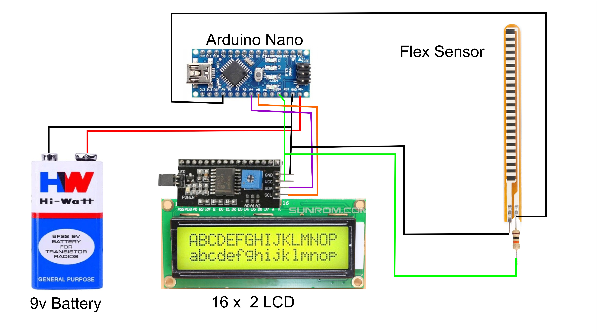
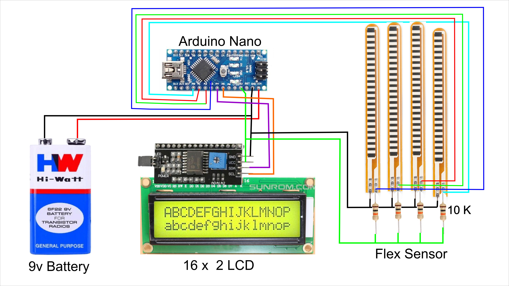
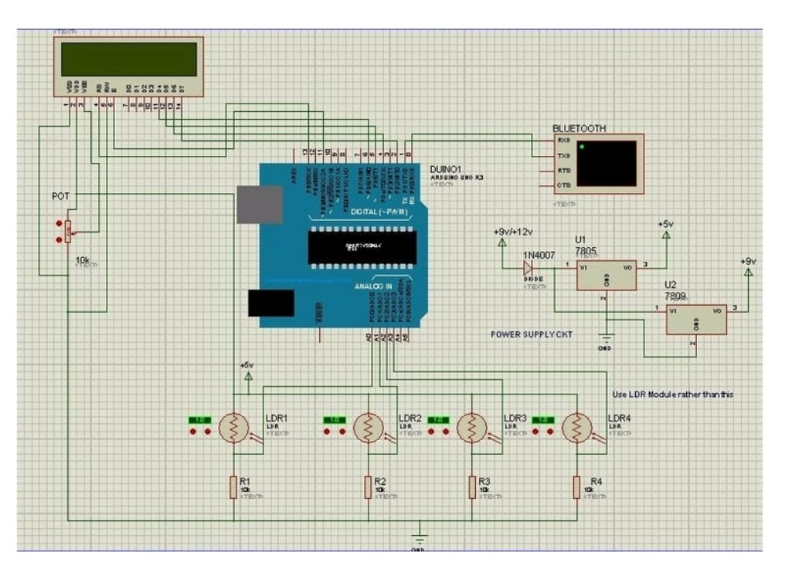
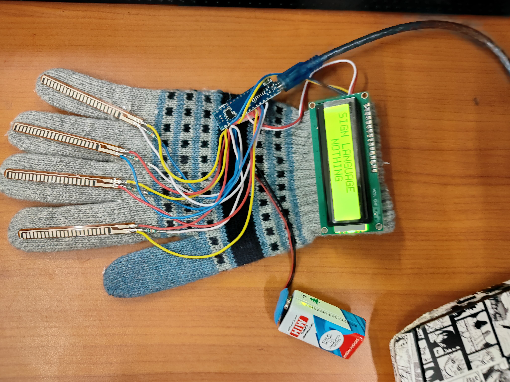
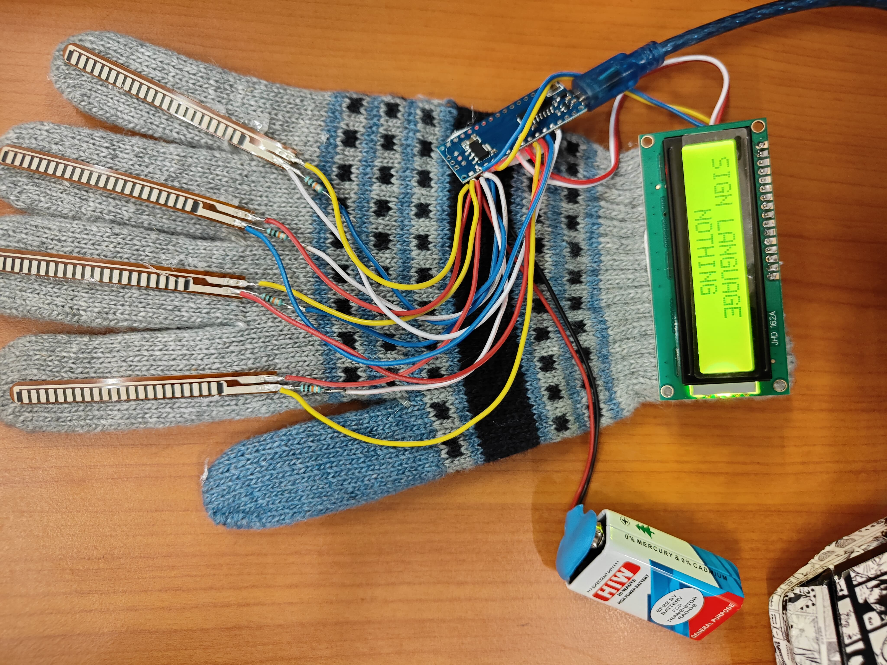

# Sign Language Glove using Arduino

## Overview
The Sign Language Glove using Arduino is an assistive device designed to translate hand gestures into text and audible signals. This project aims to bridge the communication gap for individuals who are speech-impaired, allowing them to communicate more effectively with others using gestures. The glove is embedded with flex sensors on each finger, which detect hand movements and send this data to an Arduino microcontroller. The Arduino interprets these movements and outputs the corresponding message on an LCD screen, along with optional audio signals through a buzzer.

## Objective
The primary goal of this project is to create a low-cost, easy-to-use wearable device that can assist speech-impaired individuals in communicating through sign language. By detecting and interpreting hand gestures, the glove provides immediate feedback by displaying the corresponding message, making it easier for the user to communicate with others who may not understand sign language.

## Key Components
- **Arduino UNO**: The heart of the project, responsible for processing the input from the sensors and controlling the output devices.
- **Flex Sensors**: Thin, flexible sensors placed on each finger of the glove. These sensors measure the bending of the fingers, translating the gesture into a variable resistance signal.
- **LCD Display (16x2)**: Displays the message corresponding to the hand gesture, providing visual feedback to the user.
- **Buzzer**: Gives an audible signal to accompany the message display, further enhancing communication.
- **Resistors & Wires**: These ensure that the circuit functions correctly, with appropriate resistance to the sensors and components.
- **Breadboard**: Used to connect all components in an organized manner during prototyping.
- **Power Supply**: The Arduino and its connected components are powered through a USB or external battery pack.

## Working Principle
The glove is equipped with flex sensors on each finger. As the user bends their fingers to make a gesture, the resistance of the flex sensors changes. These changes are detected by the Arduino through its analog input pins (A0-A3). The Arduino processes this input and matches it to predefined conditions (e.g., a specific finger bend corresponds to a specific word or phrase). Once a gesture is recognized, the Arduino sends a signal to the LCD screen to display the corresponding message, such as "Washroom" or "Drink Water." Additionally, a buzzer provides an audible signal, enhancing communication.

### Steps of Operation:
1. **Sensor Input**: Each flex sensor's resistance changes based on finger movements.
2. **Processing**: The Arduino reads the sensor values and processes them to identify the gesture.
3. **Display Output**: The identified gesture is displayed as text on the LCD.
4. **Optional Audio Feedback**: A buzzer can sound to accompany the display output for additional feedback.

## How to Use
1. **Wear the Glove**: Ensure the glove fits comfortably and the flex sensors are properly aligned with your fingers.
2. **Power On**: Connect the Arduino to a power source (USB or battery pack).
3. **Calibrate**: If necessary, calibrate the flex sensors to ensure accurate gesture detection.
4. **Perform Gestures**: Make predefined gestures with your hand. The corresponding message will be displayed on the LCD and optionally signaled by the buzzer.
5. **Interpret Feedback**: Read the message on the LCD and listen for the buzzer to confirm the gesture was recognized correctly.

## Common Errors and Troubleshooting
- **Incorrect Gesture Recognition**: Ensure the flex sensors are properly calibrated and securely attached to the glove. Check for loose connections.
- **No Display Output**: Verify the LCD is correctly wired to the Arduino and the code is properly uploaded.
- **Buzzer Not Working**: Check the buzzer connections and ensure it is receiving power.
- **Power Issues**: Ensure the power supply is adequate and the connections are secure.

## Applications
- **Communication Aid**: This glove allows people who cannot speak to communicate essential needs, such as requesting water or food, through simple hand gestures.
- **Educational Demonstrations**: The project is an excellent educational tool for teaching microcontroller programming, sensor interfacing, and human-machine interaction.
- **Healthcare**: In healthcare settings, this glove could be utilized to help patients with speech impairments convey their needs more effectively.

## Future Goals and Potential Applications
- **Automatic Wheelchairs**: The glove can be integrated with automatic wheelchair systems to enable gesture-based navigation, allowing users to control their movement with hand signals.
- **Voice Synthesis**: Future versions of the glove can include a voice synthesis module, where recognized gestures are converted into speech, offering a more versatile communication tool.
- **IoT Connectivity**: The glove can be connected to smart home devices, allowing users to control their environment (e.g., turning on lights, controlling the thermostat) with hand gestures.
- **Expanded Gesture Library**: The current system can recognize basic gestures, but future versions could include more complex gestures to allow for full sentence communication.
- **Wearable Design**: Improving the glove’s ergonomics to be lighter and more comfortable could make it suitable for daily wear, enhancing accessibility.

## License

This project is licensed under the MIT License. See the [LICENSE](LICENSE) file for more details.

## Conclusion
The Sign Language Glove using Arduino is an excellent example of how technology can be used to solve real-world problems. It is a simple yet effective tool that can dramatically improve the quality of life for individuals with speech impairments. With the ability to translate hand gestures into text and audio, the glove opens up new possibilities for communication. Additionally, the project's future potential in areas like healthcare, assistive technology, and IoT integration makes it a versatile platform for further development.

## Relevant Literature

### "A Review on Hand Gesture Recognition System"
**Authors**: N. C. Mithun, M. B. Akhtaruzzaman  
This paper reviews different hand gesture recognition techniques, with a focus on sensor-based and vision-based systems.

### "Hand Gesture Recognition and Voice Conversion System for Mute People"
**Authors**: B. Premkumar, B. Pradeep  
This paper discusses a system that converts hand gestures into voice commands, aimed at assisting mute individuals.

### "IoT-Based Hand Gesture Recognition System for Disabled People Using MEMS"
**Authors**: P. Sharmila, A. Mohanapriya  
This research focuses on an IoT-enabled gesture recognition system using MEMS sensors for disabled individuals who are unable to speak.

### "Design and Implementation of Gesture Controlled IoT for Healthcare"
**Authors**: S. Raj, R. Santhosh  
This paper outlines a healthcare application of gesture control integrated with IoT, specifically targeting communication barriers in disabled patients.

## Relevant Patents

### "Gesture-based Communication System for Disabled Persons"
**Patent No.**: US20110171650A1  
This patent describes a gesture-based communication system that converts hand movements into text or speech, aimed at assisting people with disabilities.

### "Sign Language to Speech Conversion Device"
**Patent No.**: US20140150238A1  
This patent covers a system that translates sign language gestures into synthesized speech, utilizing sensors and microcontrollers.

### "Wearable Gesture Recognition Device for Assistive Communication"
**Patent No.**: US20150076960A1  
This patent outlines a wearable device that recognizes gestures and translates them into verbal output, providing an assistive communication tool for mute individuals.

## Model Image

Below is an image of the Sign Language Glove prototype:

*Figure 1: Connection for single flex sensor.*

*Figure 2: Connection for multiple flex sensor.*

*Figure 3: TinkerCad wiring diagram.*

*Figure 4: The Sign Language Glove with flex sensors and Arduino setup.*

*Figure 5: The Sign Language Glove with flex sensors and Arduino setup.*